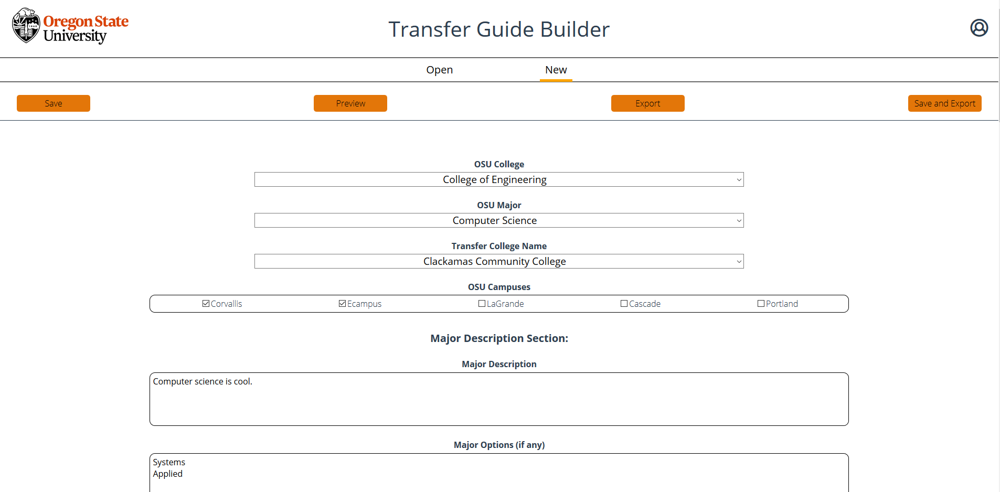
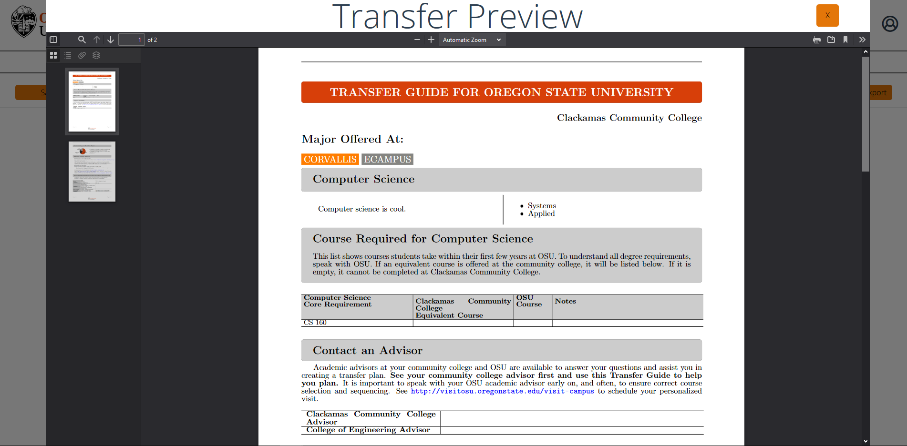

# Transfer Guide Generator

A web-based editor powered by Vue.js and Node.js that allows for Oregon State University advisors to quickly create perfectly formatted transfer guides for prospective students. This project was created in a team of 4 over the course of my 4th year at Oregon State University as part of my Senior Capstone class.

The two main components of this web app are its Vue.js front end and its Node.js backend. My focus area on this project was developing the back-end server. The main hurdle for this project was coming up with a good way to generate a custom-styled PDF filled with information provided by the user. This task was accomplished by creating a LaTex template with empty places for the entered data to be injected into the document. Then using a Node plugin, node-latex, at the user's request the server populates the LaTex template and compiles it into a PDF that is then served back to the front end. More information about the node-latex Node plugin can be found here: [node-latex](https://www.npmjs.com/package/node-latex?activeTab=readme).
It also needed to be possible to save a transfer guide for later use so all of the user entered data for each guide is stored in a Json file to be brought back out at a later date.

The other important task that the Node server has to accomplish is authentication. This tool is only to be used by Oregon State University advisors. For ease of use, our project team decided to use OSU's Single Sign-On (SSO) system. There are a few choices when it comes to SSO schemes. The most popular scheme is the SAML scheme. To bring SSO authentication support to our Node.js server, we decided to use passport-saml. Passport is an authentication middleware for Node that adds a host of functions for handling authentication. Passport also offers quite a few strategies or schemes to choose from. Since we are using SSO with the SAML scheme, we chose to use passport-saml. For more information on Passport.js visit this link: [Passport.js](http://www.passportjs.org/)

Here is a breif example of how this tool works.
First you open up a saved transfer guide or a create a new one. Then enter or modifiy the information in the input fields.

When you are ready to see how the document is shaping up, you can press the preview button and a preview of the transfer guide will be displayed to you.

